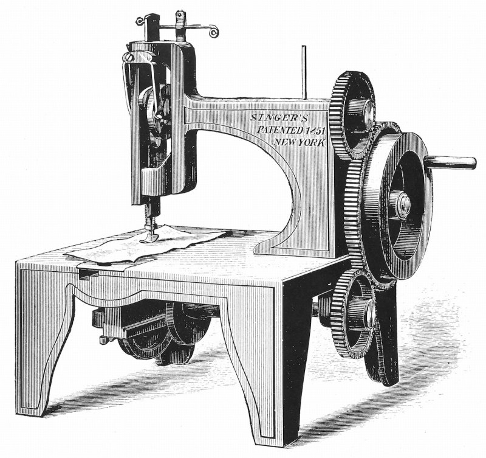
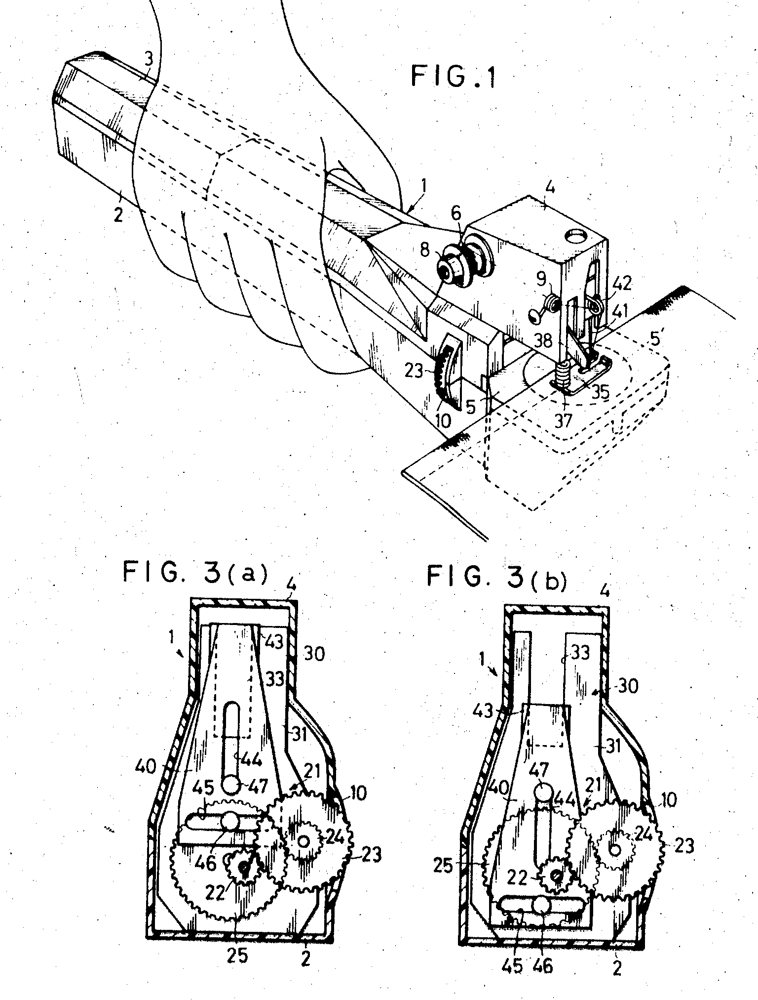
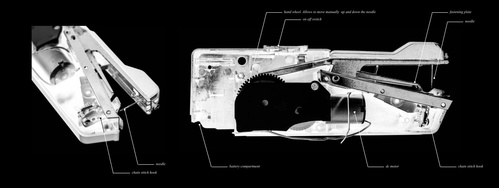
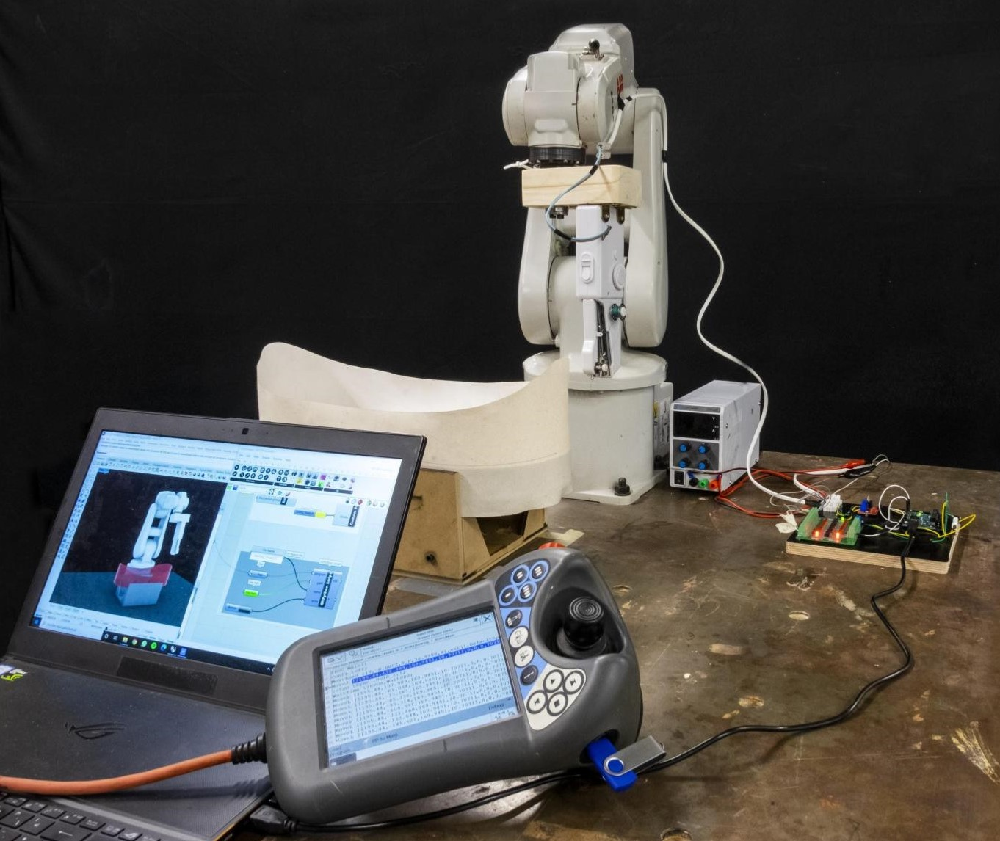
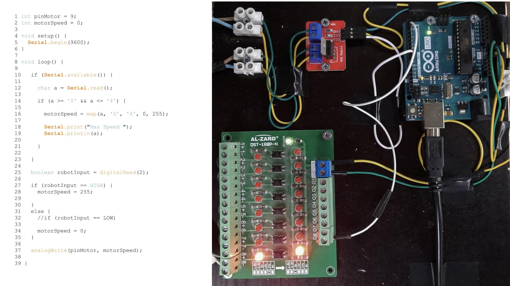
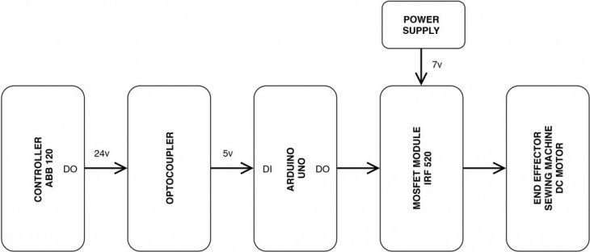
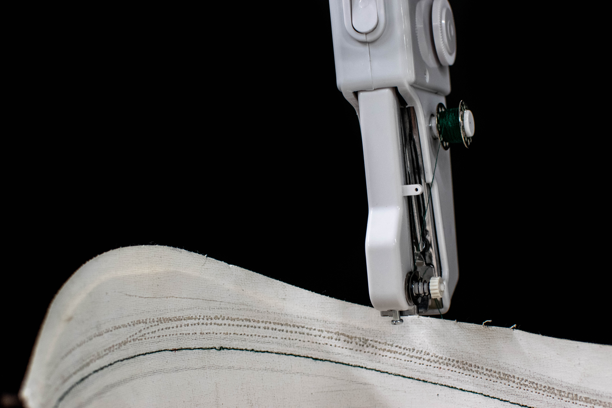
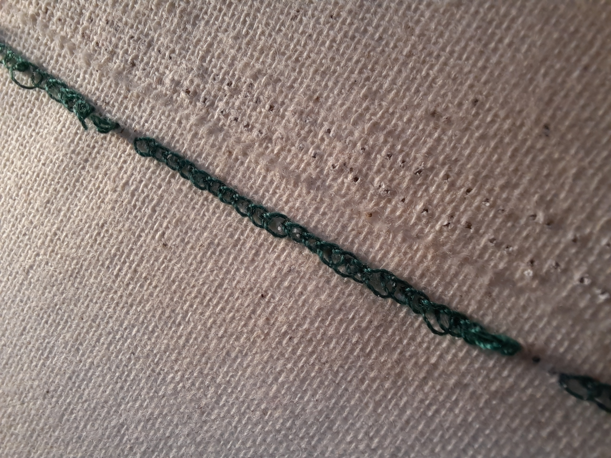

## **SEWING-ROBOT // HARDWARE I**
A sewing robotic effector to explore a dry and flexible connection of rigid materials
Explore a dry and flexible connection of rigid materials. A joint that allows to connect large parts by moving the robotic arm and not the material.
The hypothesis is to work on a joint that allows to connect large parts by moving the robotic arm and not the material. The goal to achieve is to explore a new field of connections and joints with traditional systems.

### **Concept**
According to the traditional techniques for sewing, the machine is stable and the material is moving. In our case the process is inverted, as the machine is moving freely by the robotic arm and the material is held by a support structure.

|               1 |               2 |              3 |               4 |
| -------------- | -------------- | ------------- | -------------- |
|  |  |   |  |

**1. First sewing machine, patented 1851**
Wood engraving image of Isaac Merrit Singer's Universal Images Group / Getty Images. At Latson, Jennifer. The Invention That Spawned a Fashion Revolution. Time Magazine.  August 12 2015 https://time.com/3985665/sewing-machine-invented/

**2. Portable electric sewing machine, Patent US3745950A United States**
https://patents.google.com/patent/US3745950A/

**3. Gibbs' rotating hook chain stitch mechanism**
http://ismacs.net/willcoxandgibbs/james-gibbs-other-chain-stitch-sewing-machine.html

**4. Position of the hands and explanation of chain stitch**
https://www.gutenberg.org/files/20776/20776-h/chapter_9.html

### **Portable Sewing Machine**
During the manual tests with the machine in the original state, we defined the parts that need to be modified. Since the machine will be controlled by the arduino we changed the on/off button with a digital signal from the arduino.

### **BOM**

### **Schematic and Wire prototype**
|               |                |
| ------------- | -------------- |
|  |  | 

### **Firmware sketch**
|               |                |               
| ------------- | -------------- | 
|  |  |  
 
# Workflow:
src/Sewing01.ino

**SEWING-ROBOT // HARDWARE I** is a project of **IAAC, Institute for Advanced Architecture of Catalonia**, developed at the Master in Robotics and Advanced Construction in 2020/2021 by:

**Students:** Alberto Browne, Juan E. Ojeda, Orestis Pavlidis

**Faculty:** Angel Muñoz

**Faculty Assistant:** Matthew Gordon
